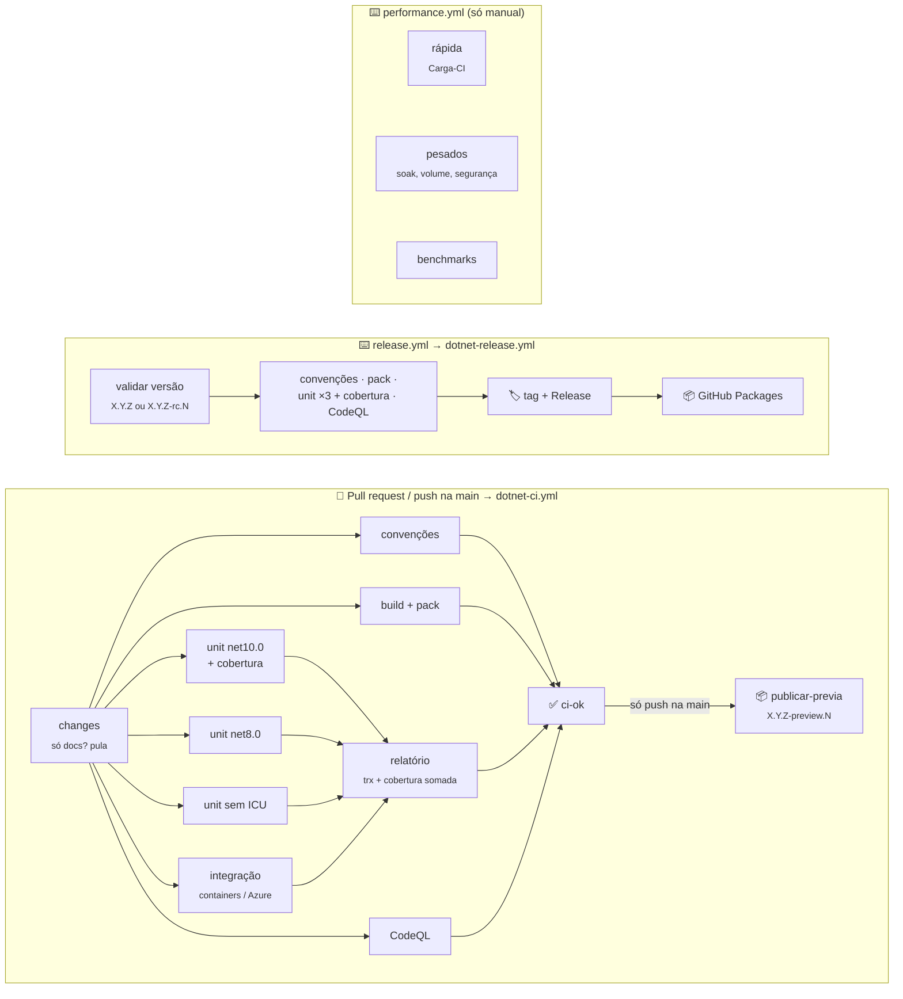
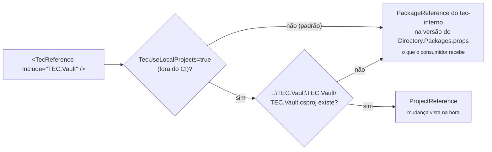
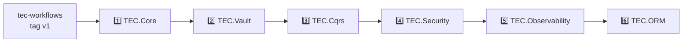

<div align="center">


# ⚙️ tec-workflows

**CI/CD, build e padrões compartilhados por todos os componentes `lib-tec-*`.**

Workflows reutilizáveis · Composite actions · Arquivos canônicos de build · Guia de padrões

[📐 Padrões](docs/padroes.md) · [🗺️ Fluxo](#️-fluxo) · [🚀 Usando num componente](#-usando-num-componente) · [🧩 Template](#-template-arquivos-canônicos) · [🔑 Configuração](#-configuração-uma-vez) · [📦 Publicação](#-ordem-de-publicação)

</div>

---

## 📑 Sumário

- [📂 Conteúdo](#-conteúdo)
- [🗺️ Fluxo](#️-fluxo)
- [🚀 Usando num componente](#-usando-num-componente)
- [📋 Entradas](#-entradas)
- [🧩 Template (arquivos canônicos)](#-template-arquivos-canônicos)
- [💻 Desenvolvimento local entre componentes](#-desenvolvimento-local-entre-componentes)
- [🔑 Configuração (uma vez)](#-configuração-uma-vez)
- [📦 Ordem de publicação](#-ordem-de-publicação)
- [🛡️ Segurança](#️-segurança)
- [💰 Custo no GitHub Free](#-custo-no-github-free)

---

## 📂 Conteúdo

| Arquivo | Tipo | Função |
|---|---|---|
| [`dotnet-ci.yml`](.github/workflows/dotnet-ci.yml) | Workflow reutilizável | Validação de PR e do push na `main`: convenções, build + pack, unitários em matriz, integração e CodeQL **em paralelo**; check único `ci-ok`. No push na `main`, publica a prévia `<Version>-preview.N`. Sem testes de carga |
| [`dotnet-release.yml`](.github/workflows/dotnet-release.yml) | Workflow reutilizável | Publicação de versão estável ou `-rc.N`: convenções, pack, unitários em matriz + cobertura e CodeQL, depois tag + Release + GitHub Packages |
| [`dotnet-test.yml`](.github/workflows/dotnet-test.yml) | Workflow reutilizável | Job de testes genérico (matriz, integração com containers/Azure OIDC, carga); usado pelos outros dois e pelo `performance.yml` dos componentes |
| [`dotnet-benchmark.yml`](.github/workflows/dotnet-benchmark.yml) | Workflow reutilizável | BenchmarkDotNet `net8.0` × `net10.0` com relatório no resumo |
| [`codeql-dotnet.yml`](.github/workflows/codeql-dotnet.yml) | Workflow reutilizável | CodeQL C#, SARIF em artifact, falha com alertas de severidade ≥ 7,0 |
| [`actions/setup-dotnet`](actions/setup-dotnet/action.yml) | Composite action | SDK do `global.json` + runtimes, cache NuGet pelos lock files, credencial do `tec-interno`, variáveis extras e `restore --locked-mode` |
| [`actions/test-summary`](actions/test-summary/action.yml) | Composite action | Consolida `.trx` de vários jobs no resumo (aprovados, falhas, pulados com motivo) |
| [`actions/check-conventions`](actions/check-conventions/action.yml) | Composite action | Compara os arquivos canônicos do componente com `template/` e valida convenções dos csproj |
| [`template/`](template) | Arquivos canônicos | Build compartilhado (`build/Tec.Build.props`/`.targets`), `.editorconfig`, `nuget.config`, `.gitignore`, `dependabot.yml`... |
| [`scripts/sync-template.sh`](scripts/sync-template.sh) | Script | Copia `template/` para os repositórios vizinhos |
| [`docs/padroes.md`](docs/padroes.md) | Guia | Regras de arquitetura, código, segurança, concorrência, testes, documentação e CI/CD |

---

## 🗺️ Fluxo



| Evento no componente | O que roda | Publica? |
|---|---|:---:|
| `pull_request` / `merge_group` | `dotnet-ci.yml` | ❌ |
| `schedule` semanal do `ci.yml` | `dotnet-ci.yml` completo (CodeQL com consultas novas, vulnerabilidades novas, Azure na main) | ❌ |
| **Performance** (`performance.yml`, manual) | Carga rápida e/ou suítes pesadas (`dotnet-test.yml`, input `suite`) e benchmarks opcionais | ❌ |
| `push` na `main` (merge) | `dotnet-ci.yml` completo e, com `ci-ok` verde, `publicar-previa` | ✅ `<Version>-preview.N` |
| **Publicar versão** (`release.yml`, manual) | `dotnet-release.yml` | ✅ estável (`X.Y.Z`) ou `-rc.N` |

Fluxo de versões: PR → merge na `main` → prévia automática (ex.: `0.0.1-preview.3`, com a `<Version>` do
`Directory.Build.props` e N sequencial por versão); versão estável ou `-rc.N` → **Actions → Publicar versão**. Depois de
publicar `X.Y.Z`, suba a `<Version>` para a próxima quando quiser novas prévias: enquanto a tag `v<Version>` existir, o
CI do push na `main` valida tudo normalmente, mas não gera prévia (avisa com um `::notice::` e pula o `publicar-previa`).
Assim um componente pode ficar numa versão publicada (ex.: TEC.Core em `0.0.1`) e ainda receber correções na `main`.

No PR (e na merge queue) o build e o pack usam `<Version>-ci.<run>`, sem publicar: sendo pré-versão, o pack aceita
dependências TEC.* em prévia (sem o `NU5104`). É o caso de um componente que acompanha a versão nova de outro antes do
lançamento (ex.: TEC.ORM `0.1.0` usando TEC.Cqrs `0.1.0-preview.1`). A versão estável só sai pelo release, e aí as
dependências TEC.* também precisam ser estáveis: publique na [ordem](#-ordem-de-publicação).

> [!NOTE]
> **Número da prévia:** o commit da `main` que definiu a `<Version>` atual gera o `preview.1` e cada commit seguinte da
> `main` (um por merge de PR) soma 1. A sequência reinicia a cada nova `<Version>`, não consulta o feed, não colide
> entre execuções simultâneas e uma reexecução gera o mesmo número. O número é SemVer numérico: `preview.10` vem depois
> de `preview.9` (o NuGet não aceita `0.0.1.preview-001`, e `preview-001` ordenaria como texto).

| `<Version>` | Commits na `main` | Prévias |
|---|---|---|
| `0.0.1` | commit que criou a versão, merge, merge | `0.0.1-preview.1`, `0.0.1-preview.2`, `0.0.1-preview.3` |
| `0.0.1` | **Publicar versão** `0.0.1` | `0.0.1` (estável) |
| `0.0.2` | merge que sobe a versão, merge | `0.0.2-preview.1`, `0.0.2-preview.2` |

> [!NOTE]
> Testes de carga (`Carga-CI`, `Carga-Pesada`, `Seguranca-Pesada`) **não** rodam no PR nem na publicação: tempo de
> parede em runner compartilhado é ruidoso e não pode bloquear PR nem versão. Rodam só sob demanda, no `performance.yml`.
> A publicação também não roda a integração: ela já passou no PR e no push da `main` que gerou a prévia.

---

## 🚀 Usando num componente

`.github/workflows/ci.yml`:

```yaml
name: CI
on:
  pull_request:
    branches: [main]
  push:
    branches: [main]           # depois do ci-ok, publica a prévia <Version>-preview.N
  merge_group:
  schedule:
    - cron: '0 6 * * 1'
  workflow_dispatch:

permissions:
  contents: read

concurrency:
  # PR: push novo cancela a execução anterior; fora de PR, um grupo por execução (nenhuma prévia é descartada)
  group: ${{ github.event_name == 'pull_request' && format('ci-{0}', github.ref) || format('ci-{0}', github.run_id) }}
  cancel-in-progress: true

jobs:
  ci:
    uses: tudoemcodigo/tec-workflows/.github/workflows/dotnet-ci.yml@v1
    permissions:
      contents: read
      pull-requests: read
      packages: write          # publicar-previa (só no push na main; em PR nada é publicado)
      actions: read
      security-events: read
      id-token: write          # exigido pelo dotnet-test.yml (Azure OIDC, usado só na integração)
    with:
      solution: TEC.Exemplo.slnx
      private-feed: true       # se depender de outro TEC.*
      unit-tests: TEC.Exemplo.Tests /*/*/*/*[Category!=Integracao]
      integration-tests: TEC.Exemplo.Tests /*/*/*/*[Category=Integracao]
      integration-setup: .github/scripts/integration-setup.sh
      integration-teardown: .github/scripts/integration-teardown.sh
      azure-client-id: ${{ vars.AZURE_CLIENT_ID }}
      azure-tenant-id: ${{ vars.TEC_TESTES_TENANT_ID }}
      azure-env: |
        TEC_TESTES_VAULT_URI=${{ vars.TEC_TESTES_VAULT_URI }}
        TEC_TESTES_TENANT_ID=${{ vars.TEC_TESTES_TENANT_ID }}
    secrets:
      test-env: |
        TEC_EXEMPLO_SEGREDO=${{ secrets.TEC_EXEMPLO_SEGREDO }}
```

O `release.yml` recebe `version` (`X.Y.Z` ou `X.Y.Z-rc.N`), `solution`, `unit-tests` e as entradas gerais da tabela abaixo (sem integração nem Azure) e o `performance.yml` (só manual, input `suite`: `pesadas`, `rapida` ou `todas`) chama o `dotnet-test.yml` direto. Exemplo completo: [lib-tec-core](https://github.com/tudoemcodigo/lib-tec-core/tree/main/.github/workflows).

> [!TIP]
> Testes são declarados **uma execução por linha**, no formato `<projeto> [treenode-filter]`. Cada linha tem a sua
> pasta de resultados (o `.trx` de uma execução nunca sobrescreve o de outra).

---

## 📋 Entradas

| Entrada | `ci` | `release` | Padrão | Uso |
|---|:---:|:---:|---|---|
| `solution` | ✅ | ✅ | — | Compilada inteira e empacotada (só projetos `IsPackable`) |
| `unit-tests` | ✅ | ✅ | — | Matriz `net10.0` (cobertura) · `net8.0` · `net10.0` sem ICU |
| `version` | — | ✅ | — | `X.Y.Z` ou `X.Y.Z-rc.N` (prévias saem só do CI, no push na `main`) |
| `integration-tests` | ✅ | — | vazio | `net10.0`, com cobertura; vazio = sem job |
| `integration-setup` / `integration-teardown` | ✅ | — | vazio | Scripts em `.github/scripts/` (containers, segredos temporários). Recebem `TEC_AZURE_LOGIN=1` quando o login OIDC ocorreu |
| `env` | ✅ | ✅ | vazio | `NOME=valor` por linha, para todos os jobs de teste |
| `private-feed` | ✅ | ✅ | `false` | Credencial do `tec-interno` (componentes que dependem de outro TEC.*) |
| `azure-client-id` / `azure-tenant-id` | ✅ | — | vazio | Login OIDC na integração, **só na main e fora de PR** |
| `azure-env` | ✅ | — | vazio | `NOME=valor` aplicados **só depois do login no Azure** (ex.: URI do cofre de testes): em PR os testes de Azure se pulam |
| `codeql-build-mode` / `codeql-queries` | ✅ | ✅ | `none` / `security-extended` | `manual` + `security-and-quality` se o componente quiser |
| `docs-pattern` | ✅ | — | docs, LICENSE, CHANGELOG, READMEs de samples/.github | PR só com esses arquivos pula os jobs pesados (os READMEs dos pacotes vão no `.nupkg` e não entram) |
| secret `test-env` | ✅ | — | — | `NOME=valor` por linha, mascarados no log (integração) |

---

## 🧩 Template (arquivos canônicos)

Arquivos que **devem ser idênticos** em todos os componentes. Nunca edite a cópia no componente: altere aqui e sincronize.

| Arquivo | Conteúdo |
|---|---|
| `build/Tec.Build.props` | Alvos `net8.0;net10.0`, Central Package Management, lock file, `NuGetAudit`, analisadores, `TreatWarningsAsErrors` nos pacotes, AOT, metadados NuGet, README/ícone no pacote, `InternalsVisibleTo` dos testes |
| `build/Tec.Build.targets` | `<TecReference>`: PackageReference do `tec-interno` por padrão (máquina e CI); ProjectReference para o repositório vizinho só com `-p:TecUseLocalProjects=true` (ignorado no CI) |
| `build/Polyfills/*.cs` | APIs modernas para o `net8.0` (ex.: `System.Threading.Lock`), compiladas como `internal` só nos pacotes: o código usa `Lock` sem `#if`. Satélite que enxerga internos do núcleo remove a cópia local (`<Compile Remove="$(TecRepoRoot)build/Polyfills/*.cs" />`) |
| `Directory.Build.targets` | Importa o `build/Tec.Build.targets` |
| `.editorconfig` | Estilo aplicado no build |
| `nuget.config` | Origens `nuget.org` + `tec-interno` e `packageSourceMapping` (TEC.* só do feed interno) |
| `.gitignore` · `.gitattributes` · `global.json` · `LICENSE` · `Images/Logo.png` | Iguais em todos |
| `.github/dependabot.yml` · `.github/zizmor.yml` | Atualizações semanais agrupadas com cooldown, exceto ASP.NET Core, EF Core e Roslyn ([dependências pareadas](docs/padroes.md#dependências-pareadas-atualizadas-à-mão), à mão); auditoria dos workflows |

```bash
# Na pasta D:\Projetos\Componentes (Git Bash)
tec-workflows/scripts/sync-template.sh            # todos os TEC.*
tec-workflows/scripts/sync-template.sh TEC.Vault  # só um
```

Cada componente fica só com o que é dele:

```xml
<!-- Directory.Build.props -->
<Project>
  <PropertyGroup>
    <TecComponent>TEC.Vault</TecComponent>
    <Version>0.0.1</Version>
  </PropertyGroup>
  <Import Project="build/Tec.Build.props" />
</Project>
```

O job **Convenções** do CI falha se um arquivo canônico divergir, se um csproj declarar `Version` em `PackageReference`/`<Version>`, ou se referenciar um componente TEC.* por `PackageReference`.

---

## 💻 Desenvolvimento local entre componentes



- **Padrão, na máquina e no CI:** `PackageReference` do feed interno `tec-interno`, na versão declarada no
  `Directory.Packages.props` do repositório (`<PackageVersion Include="TEC.Core" Version="0.0.1" />`): exatamente o
  que o consumidor recebe. Componentes evoluem em versões independentes: o TEC.Core pode continuar em `0.0.1` enquanto
  o TEC.Vault vai para `0.0.2`.
- Por isso, compilar um componente que depende de outro TEC.* exige **leitura do feed `tec-interno`** na máquina. O
  GitHub Packages exige token mesmo para pacote público; configure a credencial uma vez (PAT classic com
  `read:packages`; no Linux/macOS acrescente `--store-password-in-clear-text`):

  ```bash
  dotnet nuget update source tec-interno -u <usuario-github> -p <PAT>
  # ou, se a origem ainda não existir no NuGet.Config do usuário:
  dotnet nuget add source https://nuget.pkg.github.com/tudoemcodigo/index.json -n tec-interno -u <usuario-github> -p <PAT>
  ```

- **Modo local, sob demanda:** com os repositórios clonados lado a lado em `D:\Projetos\Componentes\TEC.*`,
  `-p:TecUseLocalProjects=true` troca o `TecReference` por `ProjectReference` para o projeto vizinho (ex.: alterar o
  TEC.Core e testar no TEC.Vault sem publicar pacote). Sem o vizinho, continua `PackageReference`. No CI (`CI=true`)
  a opção é ignorada: o CI sempre valida o pacote.

  ```bash
  dotnet build TEC.Vault.slnx -p:TecUseLocalProjects=true
  ```

- No modo local o lock file é `packages.local.lock.json` (fora do git). O `packages.lock.json` versionado é o do modo
  pacote (o padrão) e é regenerado com:

  ```bash
  dotnet restore TEC.Vault.slnx --force-evaluate
  ```

> [!WARNING]
> Regenerar o `packages.lock.json` em modo pacote exige que as versões TEC.* referenciadas **já estejam publicadas**
> no feed. Siga a [ordem de publicação](#-ordem-de-publicação).

---

## 🔑 Configuração (uma vez)

1. **Repositórios públicos** (este e os `lib-tec-*`): repositório público não pode usar workflows de um privado. Nada de segredo aqui.
2. **Tag `v1`**: os componentes usam `@v1`. A cada mudança compatível, crie `v1.x.y` e mova `v1`; mudança incompatível → `v2`.
   ```bash
   git tag v1.1.0 && git tag -f v1 && git push origin v1.1.0 && git push -f origin v1
   ```
3. **Proteção da `main` de cada componente** (*Settings → Rules → Rulesets*): exigir PR, check obrigatório **`ci / ci-ok`**, branch atualizada (ou merge queue), bloquear push direto e force push.
4. **Organização** (*Settings → Secrets and variables*):

| Nome | Tipo | Uso |
|---|---|---|
| `PACKAGES_READ_TOKEN` | Secret **do Dependabot** | PAT classic `read:packages` (o Dependabot não usa o `GITHUB_TOKEN` e o GitHub Packages exige token) |
| `AZURE_CLIENT_ID` · `TEC_TESTES_TENANT_ID` · `TEC_TESTES_VAULT_URI` | Variables | Integração com Azure via OIDC (credencial federada `repo:tudoemcodigo/<repo>:ref:refs/heads/main`) |

---

## 📦 Ordem de publicação



Para cada componente, depois que as dependências dele estiverem no feed:

1. `dotnet restore <solução> --force-evaluate` e commit do `packages.lock.json`.
2. Push → PR → `ci-ok` verde → merge. O CI do push na `main` publica a prévia `0.0.1-preview.N` automaticamente.
3. **Actions → Publicar versão → `0.0.1`** (ou `0.0.1-rc.1`).
4. *Package settings* → visibilidade **pública** e acesso dos repositórios da organização.
5. Para gerar novas prévias, suba a `<Version>` do `Directory.Build.props` para a próxima (ex.: `0.0.2`): com a tag
   `v0.0.1` existente, o CI da `main` continua validando tudo, mas não publica prévia até esse ajuste.

---

## 🛡️ Segurança

| Controle | Como |
|---|---|
| Menor privilégio | Padrão `contents: read`; `packages: write`/`contents: write` só nos jobs `publicar`/`release` e `publicar-previa` (push na `main`); `id-token: write` só nos jobs de teste |
| Actions de terceiros fixadas por SHA | Atualizadas pelo Dependabot (cooldown de 7 dias); `zizmor` audita os workflows |
| Sem injeção | Entradas chegam aos scripts por variável de ambiente; `env`, `test-env`, `tests` e scripts validados antes do uso |
| Sem credencial no disco | `persist-credentials: false` em todo checkout; credencial do feed só no NuGet.Config do usuário do runner |
| Azure sem segredo | OIDC, só na `main` e fora de PR |
| Sem pacote órfão | Tag + Release antes do push no feed; release só sai com **todos** os portões verdes; prévia só depois do `ci-ok` |
| Cadeia de suprimentos | `restore --locked-mode`, `NuGetAudit` como erro, `packageSourceMapping` |
| CodeQL | Em paralelo; alertas ≥ 7,0 derrubam o `ci-ok` (sem prévia) e impedem o Release |

---

## 💰 Custo no GitHub Free

| Recurso | Repositório público | Como o CI aproveita |
|---|---|---|
| Minutos em runner Linux | Ilimitados | Tudo em `ubuntu-24.04` |
| Jobs simultâneos | 20 por conta | ~8 jobs paralelos por PR; `concurrency` cancela execuções antigas do mesmo PR |
| Cache | 10 GB por repositório | Cache do NuGet pelos lock files |
| PR só de documentação | — | `changes` pula build, testes e CodeQL (segundos) |
