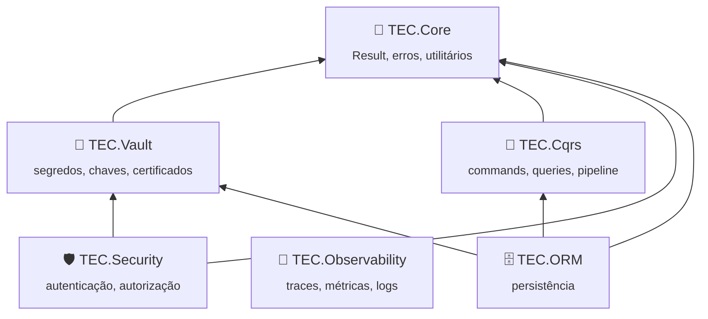

# 📐 Padrões dos componentes TEC

> [!IMPORTANT]
> Este guia é a referência única para **todos** os repositórios `lib-tec-*`. Uma regra nova entra aqui primeiro e só
> depois é aplicada nos componentes. Arquivos canônicos (build, `.editorconfig`, `nuget.config`, ...) ficam em
> [`template/`](../template) e são verificados pelo CI.

## 📑 Sumário

- [🧬 Arquitetura e dependências](#-arquitetura-e-dependências)
- [📁 Estrutura do repositório](#-estrutura-do-repositório)
- [🏗️ Build e pacotes](#️-build-e-pacotes)
- [💻 Código](#-código)
- [🛡️ Segurança](#️-segurança)
- [⚡ Concorrência e escala](#-concorrência-e-escala)
- [🧪 Testes](#-testes)
- [📚 Documentação](#-documentação)
- [⚙️ CI/CD](#️-cicd)

---

## 🧬 Arquitetura e dependências



| Regra | Detalhe |
|---|---|
| Só de cima para baixo | `TEC.Core` não depende de ninguém; `TEC.Vault` só do Core; ORM pode usar Core, Cqrs e Vault |
| Cqrs, Security e Observability são independentes entre si | Integração cruzada só por **pacote-ponte opcional** (ex.: `TEC.Cqrs.Observability`), nunca por dependência direta |
| Observability não é dependência de ninguém | Os componentes emitem `ActivitySource`/`Meter` com nome `TEC.<Componente>` (BCL, sem pacote); o Observability apenas os assina |
| Sem ciclos | Verificado pela ordem de publicação: Core → Vault → Cqrs → Security → Observability → ORM |
| Sem duplicidade | Antes de criar utilitário (guard, `Result`, comparação em tempo constante, mascaramento, JSON, hash, Base64Url, leitura limitada de arquivo, descrição de texto não confiável para log, uma execução por chave (`SingleFlight`), mensagens padrão de erro (`ApiResponse.DefaultMessages`)...), use o do `TEC.Core`. Se faltar algo genérico, ele entra no Core |
| Polyfills | Ficam em `build/Polyfills/` (canônico), compilados como `internal` só nos pacotes. Ex.: use `private readonly Lock _sync = new();` **sem `#if`** — no net8.0 o polyfill cobre |
| Pacotes separados por dependência pesada | `TEC.X` (abstrações, sem Azure/ASP.NET) + `TEC.X.AspNetCore`, `TEC.X.Azure`... O consumidor só carrega o que usa |
| Mesma versão na família | Todos os pacotes `TEC.X.*` de um repositório saem juntos, com a mesma versão. Satélites podem usar internos do núcleo (`InternalsVisibleTo`); por isso a documentação exige a mesma versão em todos. Nesse caso o satélite remove o polyfill local (`<Compile Remove="$(TecRepoRoot)build/Polyfills/*.cs" />`) para usar o do núcleo |

## 📁 Estrutura do repositório

```text
TEC.X/
├── .github/
│   ├── workflows/          ci.yml, release.yml, performance.yml (curtos: chamam o tec-workflows) + README.md
│   ├── scripts/            scripts de preparação da integração (containers, segredos temporários)
│   ├── dependabot.yml      ⟵ canônico
│   └── zizmor.yml          ⟵ canônico
├── build/                  Tec.Build.props / Tec.Build.targets ⟵ canônicos
├── docs/                   README.md (índice) + um arquivo por tema
├── Images/Logo.png         ⟵ canônico
├── samples/                API de exemplo e gerador de carga (nunca pacote)
├── TEC.X/                  pacote principal (README.md próprio se o repositório tiver mais de um pacote)
├── TEC.X.AspNetCore/       pacotes satélite
├── TEC.X.Tests/            unitários + integração (categoria Integracao)
├── TEC.X.LoadTests/        carga (Carga-CI, Carga-Pesada, Carga-Exclusiva)
├── TEC.X.Benchmarks/       BenchmarkDotNet
├── Directory.Build.props   TecComponent + Version (únicos dados do repositório)
├── Directory.Build.targets ⟵ canônico
├── Directory.Packages.props versões de terceiros (Central Package Management)
├── .editorconfig .gitattributes .gitignore nuget.config global.json LICENSE  ⟵ canônicos
├── CHANGELOG.md
├── README.md
└── TEC.X.slnx
```

## 🏗️ Build e pacotes

| Tema | Regra |
|---|---|
| Versão | Uma só por repositório, em `Directory.Build.props` (`0.0.1` até a primeira publicação). Nunca `<Version>` no csproj |
| Alvos | `net8.0;net10.0` (LTS). Gerador Roslyn: `netstandard2.0` |
| Pacotes de terceiros | Versão só no `Directory.Packages.props`; `CentralPackageTransitivePinningEnabled` ligado |
| Componentes TEC.* | `<TecReference Include="TEC.Vault" />` no csproj, sem versão — vira PackageReference do feed `tec-interno` por padrão, na máquina e no CI (o desenvolvedor precisa de credencial de leitura do feed); ProjectReference para o repositório vizinho só sob demanda, com `-p:TecUseLocalProjects=true` (ignorado no CI). A versão consumida é a **publicada**, declarada no `Directory.Packages.props` (`<PackageVersion Include="TEC.Vault" Version="0.0.1" />`), atualizada pelo Dependabot |
| Lock file | `packages.lock.json` versionado (modo pacote, o padrão), regenerado com `dotnet restore <solução> --force-evaluate`; restore `--locked-mode` no CI. O modo local usa `packages.local.lock.json`, fora do git |
| Avisos | Em pacotes, **todo aviso é erro** (CA, IDE, IL de AOT/trimming, nullable, CS1591) |
| AOT | `IsAotCompatible=true` por padrão. Desligar só no csproj, com comentário justificando (ex.: EF Core) |
| Metadados | Só `Description` e `PackageTags` no csproj; o resto vem de `build/Tec.Build.props` |
| README do pacote | `README.md` na pasta do projeto (repositório com vários pacotes) ou o da raiz |

## 💻 Código

| Tema | Regra |
|---|---|
| Idioma | **Identificadores em inglês**; comentários, XML docs, mensagens de erro/log e documentação em **português** |
| API pública | Mínima e intencional: classes `sealed` por padrão, `internal` para o resto; toda API pública com XML doc (`<summary>`, `<param>`, `<returns>`, `<exception>`) |
| Registro em DI | Extensões `AddTecX(this IServiceCollection, Action<TecXOptions>?)` com `TryAdd*`; chamar duas vezes é idempotente **ou** falha explicitamente (nunca ignora em silêncio uma configuração diferente) |
| Opções | `IOptions<T>` + validação (`IValidateOptions<T>`/`ValidateOnStart`): configuração inválida falha na subida, não na primeira requisição |
| Assíncrono | `CancellationToken` em toda API assíncrona pública; `ConfigureAwait(false)` (CA2007); nada de `.Result`/`.Wait()` |
| Tempo | `TimeProvider` injetável (testável), nunca `DateTime.Now` direto |
| Logs | `LoggerMessage` gerado por source generator; nunca registrar segredo, token, senha ou dado pessoal sem máscara |
| Erros | `Result`/`Error` e exceções do `TEC.Core`; mensagens sem detalhes internos para o cliente |
| Estilo | `.editorconfig` canônico, aplicado no build (`EnforceCodeStyleInBuild`) |

## 🛡️ Segurança

| Ameaça | Controle obrigatório |
|---|---|
| Entrada maliciosa / DoS | Limites explícitos de tamanho e quantidade; `Regex` com `[GeneratedRegex]` e timeout ou `NonBacktracking`; streaming para dados grandes |
| Vazamento de segredo | Segredos só via `TEC.Vault`; `ToString()`/logs mascarados; `persist-credentials: false` no CI |
| Criptografia | Só pelo `TEC.Core.Cryptography` (AES-GCM, RSA-OAEP/PSS, PBKDF2 600k); comparação em tempo constante |
| Desserialização | `System.Text.Json` com source generation; nunca `BinaryFormatter`/tipos polimórficos abertos |
| Cadeia de suprimentos | `NuGetAudit` (vulnerabilidade quebra o build), `packageSourceMapping`, lock file, actions fixadas por SHA, Dependabot com cooldown |
| SAST | CodeQL `security-extended` em todo PR; alerta ≥ 7,0 bloqueia |

## ⚡ Concorrência e escala

- Todo serviço registrado como **singleton** é thread-safe; estado mutável compartilhado só com `ConcurrentDictionary`, `Interlocked`, `Lazy<T>` ou `lock` curto (nunca `await` dentro de lock; use `SemaphoreSlim`).
- Nenhum estado estático mutável.
- `HttpClient` via `IHttpClientFactory` ou um `SocketsHttpHandler` compartilhado com `PooledConnectionLifetime` (renova DNS/conexões); nunca `new HttpClient()` por chamada. Listagens e leituras de respostas externas sempre com teto; caches com limite de tamanho e expiração; *stampede* evitado (uma carga por chave).
- Recursos com `IAsyncDisposable`/`IDisposable` corretos; `ObjectDisposedException` após descarte.
- Testes de concorrência (`Carga-CI`) provam a segurança em paralelo; carga pesada mede vazão e memória.

## 🧪 Testes

| Categoria (`[Category]`) | Onde roda | Conteúdo |
|---|---|---|
| *(sem categoria)* | PR, push na `main` e release, matriz `net10.0` / `net8.0` / sem ICU | Unitários, regressão, segurança rápida |
| `Integracao` | PR e push na `main` (containers; Azure via OIDC só na main) | Dependências reais |
| `Carga-CI` | `performance.yml` (manual, `suite` = `rapida` ou `todas`) | Concorrência e fumaça de carga (segundos) |
| `Carga-Pesada`, `Seguranca-Pesada` | `performance.yml` (manual, `suite` = `pesadas` ou `todas`) | Soak, volume, canais laterais de tempo |
| `Carga-Exclusiva` | Manual | Máquina dedicada |

Framework: **TUnit** (Microsoft.Testing.Platform). Nome dos testes descreve o comportamento (`Encrypt_with_tampered_tag_fails`).

| Convenção | Regra |
|---|---|
| Seleção | Sempre por **categoria** (`--treenode-filter "/*/*/*/*[Category=...]"`), nunca por namespace nem por variável liga/desliga |
| Unitários no CI | `/*/*/*/*[Category!=Integracao]` (os de carga ficam no projeto `*.LoadTests`) |
| Integração sem ambiente | O teste se **pula com motivo** (`Skip`) quando a variável do serviço não existe (ex.: `TEC_TESTES_VAULT_URI`); nunca falha nem passa em silêncio |
| Variáveis de serviços de teste | Prefixo `TEC_TESTES_` (compartilhadas: `TEC_TESTES_VAULT_URI`, `TEC_TESTES_TENANT_ID`; específicas: `TEC_TESTES_<COMPONENTE>_*`) |
| Parâmetros de carga | Prefixo `TEC_CARGA_` (específicos como `TEC_CARGA_SOAK_SEGUNDOS`; `TEC_CARGA_FATOR` quando a suíte usa um fator único de duração) |
| Relatórios de carga | Pasta em `TEC_CARGA_RELATORIOS` (o CI define); cada suíte grava `*.md` ali — o CI publica no resumo da execução |
| Constantes de categoria | Num único lugar por projeto de teste (de preferência uma classe `TestCategories`: `Integration = "Integracao"`, `LoadCi = "Carga-CI"`, ...), nunca a string repetida |

## 📚 Documentação

Tudo em **português**, visual (emojis nos títulos, tabelas, diagramas Mermaid, alertas `> [!NOTE]`/`> [!WARNING]`) e fácil de ler.

### README.md da raiz (até ~350 linhas)

| # | Seção | Conteúdo |
|---|---|---|
| 1 | Cabeçalho centralizado | Logo, `# <emoji> TEC.X`, frase de valor, badges (CI, .NET, AOT, versão, licença), links rápidos |
| 2 | 📑 Sumário | Links para as seções |
| 3 | ✨ Por que usar | Tabela "sem × com" + bullets curtos |
| 4 | 📦 Pacotes | Tabela: pacote, para que serve, quando instalar, depende de |
| 5 | 🧬 Ecossistema TEC | Diagrama padrão (o desta página) com o componente destacado |
| 6 | 📥 Instalação | Feed do GitHub Packages (PAT `read:packages`) + `dotnet add package` |
| 7 | 🚀 Início rápido | Menor código que funciona |
| 8 | 📚 Documentação | Tabela com cada arquivo de `docs/` e o que ele responde |
| 9 | ⚡ Compatibilidade | .NET 8/10, AOT, sem ICU, sistemas |
| 10 | 🛡️ Segurança · 🧪 Testes | Resumo + link para `docs/` |
| 11 | 🤝 Contribuição · 🏷️ Versionamento · 📄 Licença | Curto |

### Arquivos de `docs/`

```markdown
[🏠 TEC.X](../README.md) › [📚 Documentação](README.md) › <Tema>

# <emoji> <Tema>

> Uma frase: o que este tema resolve.

## 📑 Sumário
## 🎯 Visão geral        (diagrama Mermaid quando houver fluxo)
## 🚀 Uso                (exemplos de código completos)
## ⚙️ Opções             (tabela: opção, padrão, descrição)
## ❌ Erros              (tabela: código/exceção, quando ocorre, o que fazer)
## 🛡️ Segurança          (alertas [!WARNING] para armadilhas)
## ❓ Perguntas frequentes

---
⬅️ [Anterior](x.md) · [📚 Índice](README.md) · [Próximo](y.md) ➡️
```

Quando o título do arquivo coincide com uma seção fixa (ex.: `seguranca.md` → `# 🛡️ Segurança` e `## 🛡️ Segurança`), o GitHub dá à seção a âncora com sufixo `-1`: o link do sumário aponta para ela (`#️-segurança-1`). `docs/README.md` é o índice (tabela + mapa Mermaid dos temas). `CHANGELOG.md` segue *Keep a Changelog* (uma entrada `0.0.1` até a primeira publicação). `.github/workflows/README.md` descreve os workflows e as Variables/Secrets necessárias.

## ⚙️ CI/CD

Ver [README do tec-workflows](../README.md). Resumo: PR → `ci-ok` (convenções, build+pack, unitários em matriz, integração e CodeQL **em paralelo**); push na `main` → o mesmo CI e, com `ci-ok` verde, a prévia `<Version>-preview.N` no feed; `release.yml` manual (`X.Y.Z` ou `X.Y.Z-rc.N`), com convenções, pack, unitários + cobertura e CodeQL antes de criar a tag e publicar; depois de publicar `X.Y.Z`, suba a `<Version>` para voltar a gerar prévias (enquanto a tag `v<Version>` existir, o CI da `main` valida tudo, mas não publica prévia: emite um `::notice::` e pula o `publicar-previa`). Testes de carga (`Carga-CI`, `Carga-Pesada`, `Seguranca-Pesada`) só no `performance.yml`, manual: tempo de parede em runner compartilhado é ruidoso e não pode bloquear PR nem versão.
